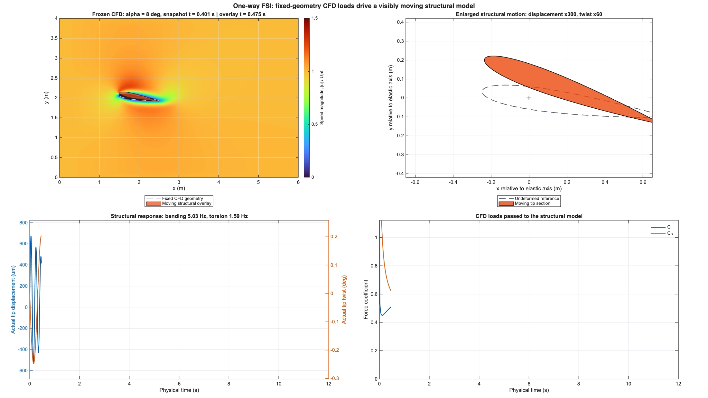

# Airfoil One-Way FSI in MATLAB

A compact, classroom-oriented MATLAB case for two-dimensional NACA 0012 flow, angle-of-attack sweeps, Brinkman immersed-boundary treatment, aerodynamic loads, and one-way structural response.

The package is intended for teaching numerical fluid mechanics and basic aeroelastic response. It uses a fixed airfoil geometry in the CFD solve; the computed loads drive a reduced-order cantilever model, but structural motion never modifies the flow. It is therefore **not** a two-way FSI solver and is not a real-airfoil stall predictor.

## What students can learn

- Build a Cartesian MAC-grid flow calculation for incompressible Navier-Stokes flow.
- See how a Brinkman volume-penalization mask represents an immersed airfoil.
- Sweep prescribed angle of attack and compare lift, drag, and qualitative separation trends.
- Test sensitivity to grid resolution, time step, penalty time scale, and domain size.
- Transfer transient aerodynamic loads to bending and torsion response using a two-degree-of-freedom Newmark model.

The default case is two-dimensional, laminar, and `Re = 100`. It omits transition, turbulence, roughness, finite-wing effects, and flow feedback from the moving structure. Report qualitative separation trends only; do not report a predicted physical stall angle or validated maximum-lift coefficient.

## Requirements

- MATLAB R2023b or newer.
- No toolboxes are required.
- MP4 export requires a MATLAB installation that supports `VideoWriter(...,'MPEG-4')`. Use an `.avi` output instead if MP4 is unavailable on your platform.

## Quick start

Open MATLAB in this folder and run:

```matlab
check_lab                         % fast numerical and symmetry checks
[polar,cases] = run_airfoil_lab('demo')
run_video_demo(8)                % transient fixed-geometry CFD video
run_oneway_motion_demo(8)        % one-way structural-motion video
run_sensitivity                  % optional numerical sensitivity study
```

Every solve creates `grid_preview_alpha_*.png` before time marching. The left panel shows the Cartesian pressure grid. The right panel zooms into the airfoil and displays the `u`-face Brinkman mask and the staggered `u`/`v` locations.

Generated files are written below `results/` and are ignored by Git:

- `polar.csv`: angle-of-attack summary.
- `history_alpha_*.csv`: instantaneous coefficients and solver diagnostics.
- `motion_alpha_*.csv`: physical tip displacement and twist.
- `grid_preview_alpha_*.png`: mesh and immersed-boundary mask preview.
- `flow_field.png`, `polar_and_structure.png`, `history_and_span.png`: lecture-ready figures.
- `*.mp4`: high-resolution teaching videos.

Two ready-to-play, high-resolution MP4 examples are kept in `examples/` for classroom preview:

- `transient_flow_alpha_8.mp4`: fixed-geometry transient CFD field.
- `oneway_motion_alpha_8.mp4`: four-panel one-way-FSI layout with full field, enlarged wing motion, physical response, and aerodynamic loads.

The motion panel deliberately uses visual magnification. The lower-left curves retain the actual, unamplified displacement and twist.



## Model summary

In the physical fluid region, the model solves

\[
\nabla\cdot\mathbf{u}=0,\qquad
\frac{\partial \mathbf{u}}{\partial t}+\nabla\cdot(\mathbf{u}\otimes\mathbf{u})
=-\frac{1}{\rho}\nabla p+\nu\nabla^2\mathbf{u}.
\]

The Cartesian-grid extension uses the fixed-mask Brinkman term

\[
\frac{\partial \mathbf{u}}{\partial t}+\nabla\cdot(\mathbf{u}\otimes\mathbf{u})
=-\frac{1}{\rho}\nabla p+\nu\nabla^2\mathbf{u}
-\frac{\chi}{\eta}(\mathbf{u}-\mathbf{u}_s),\qquad \mathbf{u}_s=0.
\]

The penalty reaction produces the sectional load history. A one-way reduced structural model then solves

\[
M\ddot{\mathbf{q}}+C\dot{\mathbf{q}}+K\mathbf{q}=\mathbf{Q}(t),
\qquad \mathbf{q}=(h,\theta)^T.
\]

The sequence is therefore `fixed-geometry CFD -> aerodynamic load history -> structural response`. The airfoil in the one-way-motion video is a kinematic overlay: it moves visibly for teaching purposes, while the displayed CFD field remains the precomputed fixed-geometry field.

## Repository structure

| File | Purpose |
| --- | --- |
| `teaching_config.m` | All physical, numerical, structural, and output parameters. |
| `solve_airfoil_ns.m` | MAC-grid flow solver, Brinkman penalization, projection, and load extraction. |
| `plot_grid_preview.m` | Grid and immersed-boundary preview generated before each solve. |
| `run_airfoil_lab.m` | Angle-of-attack sweep and static publication-style figures. |
| `export_flow_video.m` | High-resolution transient-flow video export. |
| `run_oneway_motion_demo.m` | Load-to-structure workflow and one-way-motion video. |
| `wing_dynamics.m`, `newmark_linear.m` | Reduced structural model and Newmark time integration. |
| `run_sensitivity.m` | Grid, time-step, penalty, time-window, and domain sensitivity cases. |

## Open-source and attribution notes

The momentum-prediction routine in `solve_airfoil_ns.m` is retained line-for-line from the MathWorks Computational Fluid Dynamics courseware. Its BSD-3-Clause license is included in `LICENSE-MATHWORKS-BSD-3-CLAUSE.txt`, and the source notice must remain with redistributions. The rest of this teaching package is supplied under the BSD-3-Clause license in `LICENSE`.

The project structure and classroom workflow were informed by the public [MathWorks Computational Fluid Dynamics courseware](https://github.com/MathWorks-Teaching-Resources/Computational-Fluid-Dynamics), whose teaching module combines interactive objectives, runnable code, and visualization. It does not imply endorsement by MathWorks.

## Suggested student work

1. Explain the mesh/mask preview and identify the staggered locations of pressure, `u`, and `v`.
2. Compare `120x80`, `240x160`, and `360x240` grids while keeping `dx = dy`; explain why low divergence alone does not demonstrate load convergence.
3. Compare the trailing-edge low-speed region and `C_L`, `C_D` across angle of attack. Label the result as a low-Re separation trend.
4. Change `EI`, `GJ`, mass, and damping. Explain why the structural response changes while the CFD loads do not.

## License

See `LICENSE` and `THIRD_PARTY_NOTICES.md`.
